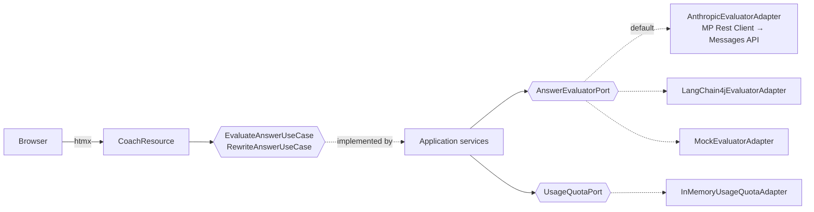

# Interview Coach

Practice technical interview answers the way you'd actually say them, and get
scored like a staff engineer would score you.

You set what you're practicing for (role, target level, years, stack), paste a
question, and answer it without notes. You get back:

- **A score on four axes:** technical accuracy, depth, terminology and clarity,
  averaged into a level (Junior, Mid, Senior, Staff) and compared with the level
  you're aiming for.
- **What worked**, quoting your own words.
- **What a senior would have added:** trade-offs, numbers, failure modes,
  pattern names.
- **A senior-level version of your answer**, written to be read out loud, that
  you can make shorter or longer.
- **English fixes** for the mistakes an interviewer would notice.
- **The follow-up question** the interviewer would ask next.

It was built for non-native speakers whose technical knowledge is solid but whose
spoken English slows them down. Imperfect English lowers *clarity*, never
*technical accuracy*. The full rubric is in [docs/rubric.md](docs/rubric.md).

## How the scoring works

There is no database of "correct answers". A language model (Claude, via the
Anthropic API) scores each answer against the [rubric](docs/rubric.md),
calibrated to your target level. The model only fills in the four axis scores
and the feedback; the average and the level are computed in code so they always
follow the rubric's bands. Treat the result as a demanding sparring partner, not
a verdict.

## Stack

- **Java 21 + Quarkus 3.33** (LTS)
- **Anthropic Messages API** through a **MicroProfile Rest Client** (default), or
  **[Quarkus LangChain4j](https://docs.quarkiverse.io/quarkus-langchain4j/dev/)**
  as an alternative adapter
- **Qute + [htmx](https://htmx.org)**: server-rendered HTML, no frontend build step
- **Hexagonal architecture** (ports and adapters), enforced by
  [ArchUnit](https://www.archunit.org) tests
- No database: your practice target and recent questions stay in your browser

## Architecture

Ports and adapters, organized by feature. Everything lives under
`dev.charold.coach.practice`:

```text
practice/
├── domain/                     plain Java, no framework imports
│   ├── model/                  Evaluation, Level, PracticeProfile, EnglishFix, RewriteDirection
│   ├── exception/              PracticeLimitReachedException
│   └── port/
│       ├── in/                 EvaluateAnswerUseCase, RewriteAnswerUseCase
│       └── out/                AnswerEvaluatorPort, UsageQuotaPort
├── application/                EvaluateAnswerService, RewriteAnswerService (plain Java)
└── infrastructure/
    ├── adapter/in/web/         CoachResource (Qute + htmx), AccessCodeGuard, dto/PracticeForm
    ├── adapter/out/ai/         AnthropicEvaluatorAdapter, LangChain4jEvaluatorAdapter, InterviewCoach,
    │                           AiPrompts (shared rubric), AiEvaluationMapper, dto/
    ├── adapter/out/ai/anthropic/  AnthropicMessagesClient (MP Rest Client), request/response
    │                              records, AnthropicErrorMapper
    ├── adapter/out/ai/mock/    MockEvaluatorAdapter
    ├── adapter/out/quota/      InMemoryUsageQuotaAdapter
    └── config/                 PracticeBeanConfig: picks which adapter backs each port
```



Decisions worth knowing:

- **The model's JSON contract stays in the adapter.** The LLM fills
  `AiEvaluationDto`, which is mapped to the domain `Evaluation`. Renaming a
  domain field never changes the prompt, and sloppy model output (missing
  lists, out-of-range scores) is cleaned up at the boundary.
- **We call the Anthropic API ourselves.** quarkus-langchain4j-anthropic always
  sends `top_k=40`, and current Claude models reject it (and `temperature`) with
  a 400. `AnthropicEvaluatorAdapter` owns the request body (model, max_tokens,
  system, messages and nothing else) and a test pins that. Swapping it in was a
  new adapter behind the same port: no domain or use-case code changed.
- **Errors say why.** `AnthropicErrorMapper` turns API error bodies into one-line
  messages like `HTTP 400 invalid_request_error: ...`.
- **Mock mode is an adapter, not an `if`.** `PracticeBeanConfig` picks the
  evaluator from `COACH_MOCK` and `COACH_PROVIDER`.
- **The access code lives in the web adapter.** It protects the API key at the
  HTTP edge; it isn't a business rule. The daily limit is a port because its
  storage will change (in memory today, a shared store with several replicas).
- **Application services carry no annotations.** They're created with `@Produces`
  in `infrastructure/config`, so the use cases are testable with plain fakes.

`ArchitectureTest` fails the build if the domain imports a framework, if the
web layer reaches an outbound adapter directly, or if anything other than the
config depends on the application services.

## Run it locally

You need Java 21 and Maven 3.9+, or just Docker.

```bash
cp .env.example .env        # then put your ANTHROPIC_API_KEY in .env
mvn quarkus:dev
```

Open http://localhost:8080.

**No API key?** Run in mock mode. Every answer gets the same sample evaluation and
nothing is sent to the API:

```bash
COACH_MOCK=true mvn quarkus:dev
```

With Docker:

```bash
docker build -t interview-coach .
docker run -p 8080:8080 -e ANTHROPIC_API_KEY=sk-ant-... interview-coach
```

## Configuration

| Variable | Default | What it does |
|---|---|---|
| `ANTHROPIC_API_KEY` | | API key from the Claude Console. Required unless mock mode is on. |
| `COACH_MODEL` | `claude-sonnet-5-5` | Model used for scoring and rewrites. |
| `COACH_PROVIDER` | `anthropic` | Evaluator: `anthropic` (direct API) or `langchain4j`. |
| `COACH_ACCESS_CODE` | empty | If set, people must enter this code before practicing. |
| `COACH_DAILY_LIMIT` | `100` | Max model calls per day for the whole instance. |
| `COACH_MOCK` | `false` | Canned responses, no API calls. |
| `COACH_LOG_LEVEL` | `INFO` (`DEBUG` in dev) | Log level for the app's own code. |
| `COACH_LOG_LLM` | `false` | LangChain4j adapter only: log the API's responses, for diagnosis. |
| `PORT` | `8080` | HTTP port (set automatically by most hosting platforms). |

All settings live in `src/main/resources/application.yaml`, with `%prod`, `%dev`
and `%test` profiles. Production logging is kept to one line per event.

### Sharing your instance

If you deploy it with your own key, anyone with the URL spends your credits.
Set `COACH_ACCESS_CODE` and share the code only with people you trust, keep
`COACH_DAILY_LIMIT` low, and set a spending limit in the Claude Console.

## Tests

```bash
mvn verify
```

Tests need no API key and spend no tokens: use cases run against hand-written
fakes, the web tests run in mock mode, and `ArchitectureTest` checks the
dependency rules. CI runs them on every push.

## Roadmap

- [x] Manual practice: question + answer, scored against the rubric
- [x] Senior-level answer, shorter or longer
- [x] Recent questions in the browser
- [ ] Generate interview questions for a role and level
- [ ] Progress per axis over time, export to Markdown
- [ ] Voice: answer out loud, transcribed in the browser, scored with the same rubric

## Extras

- [docs/english-phrasebook-es.md](docs/english-phrasebook-es.md): phrases and
  common mistakes for Spanish speakers in technical interviews (in Spanish).

## License

[MIT](LICENSE)
